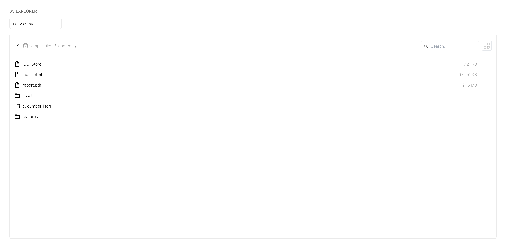
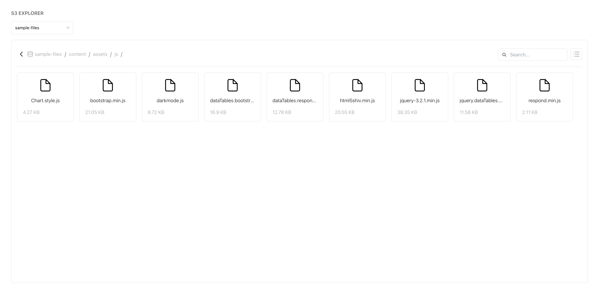
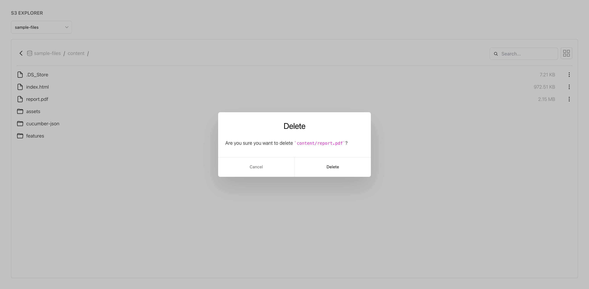
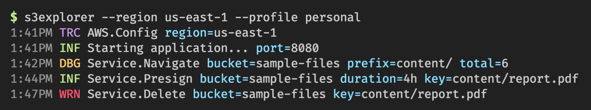

# S3 Explorer

This is something I built for personal use with [Go](https://github.com/karanpratapsingh/go-course) and [Next.js](https://nextjs.org) to quickly navigate S3 buckets. The following features are supported:

- Quick navigation across multiple buckets
- AWS region and profile support
- Generate pre-signed URLs
- Grid and List view with search
- Delete objects

### Demo

   



### Usage

For using this application, you can download the binaries for different platforms from the [Build](https://github.com/karanpratapsingh/s3-explorer/actions/workflows/build.yml) action runs.

```
$ s3explorer --region us-east-1 --profile personal
1:41PM TRC AWS.Config region=us-east-1
1:41PM INF Starting application... port=8080
```

_Note: `--profile` flag is optional._

### Development

Prepare and run application development mode.

```
$ make prepare
$ make run
```

### Build

Build the application.

```
$ make build
```
